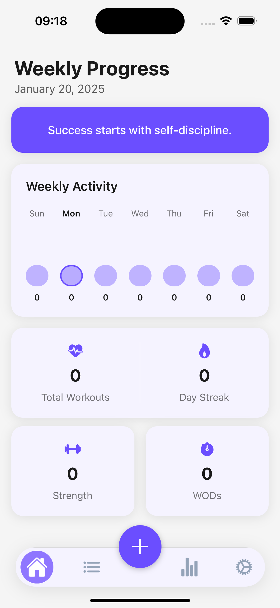
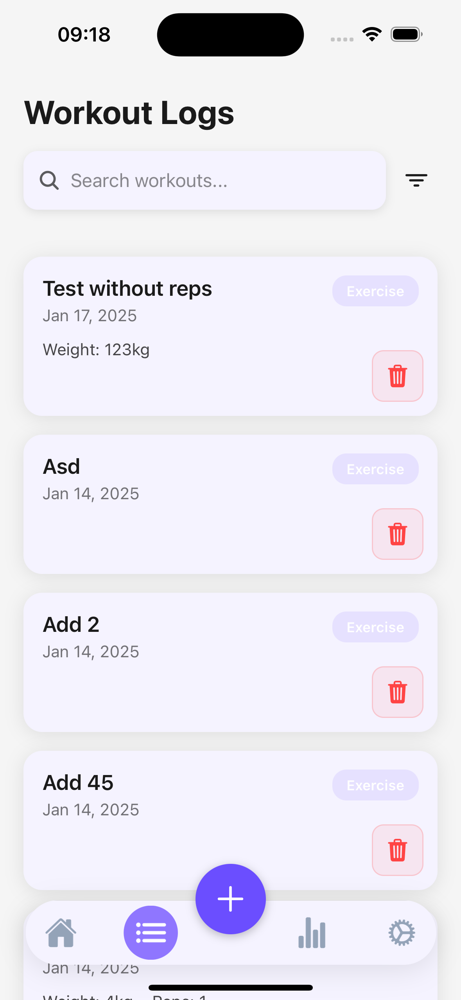
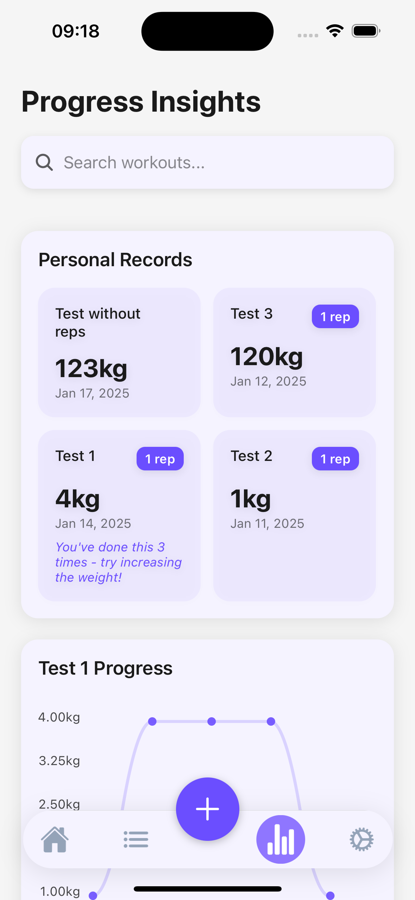
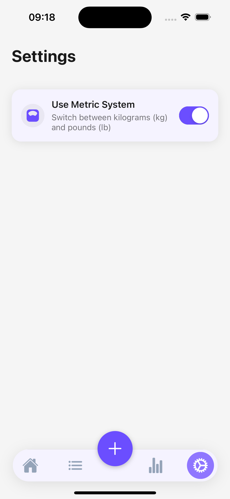

# Marca Tu Ritmo 🏃‍♂️

A modern fitness tracking app that helps you track your workouts, monitor your progress, and maintain your fitness journey. Built with React Native and Expo.

## Features

- 📊 Track your workouts and exercises
- 📈 Monitor your progress over time
- 📝 Log your fitness activities
- ⚙️ Customizable settings
- 🌙 Dark mode support

## Screenshots

| Home Screen | Workout Logging |
|------------|----------------|
|  |  |

| Progress Tracking | Settings |
|------------------|----------|
|  |  |

## Getting Started

### Prerequisites

- Node.js (v14 or higher)
- npm or yarn
- iOS Simulator or Android Emulator (optional)
- Expo Go app on your mobile device (optional)

### Installation

1. Clone the repository
   ```bash
   git clone [your-repo-url]
   cd Marca-Tu-Ritmo
   ```

2. Install dependencies
   ```bash
   npm install
   ```

3. Start the development server
   ```bash
   npx expo start
   ```

## Development Options

You can run the app on:
- iOS Simulator (press `i`)
- Android Emulator (press `a`)
- Your physical device using Expo Go (scan QR code)
- Web browser (press `w`)

## Tech Stack

- React Native
- Expo
- TypeScript
- React Navigation
- Expo Router

## Contributing

Feel free to submit issues and enhancement requests!

## License

This project is licensed under the MIT License - see the LICENSE file for details.
